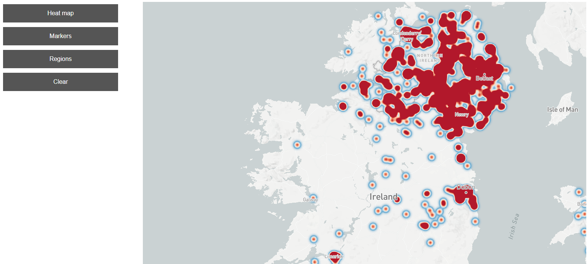
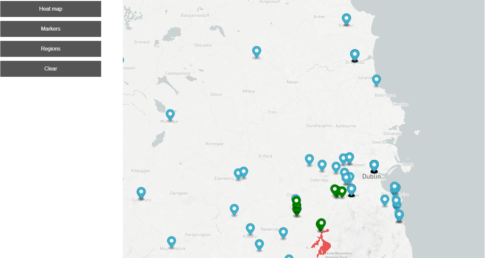
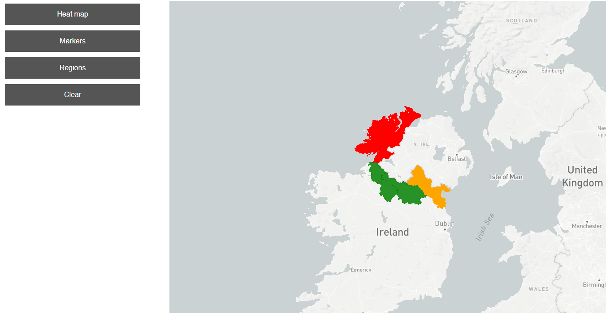
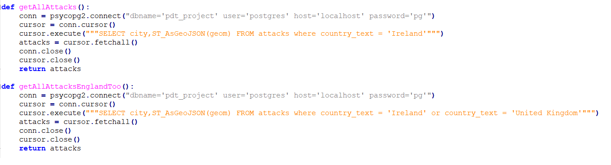
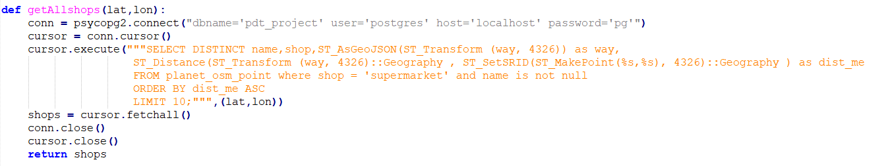
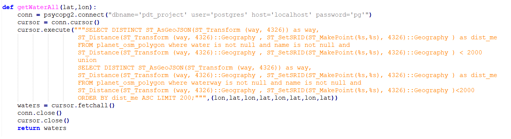
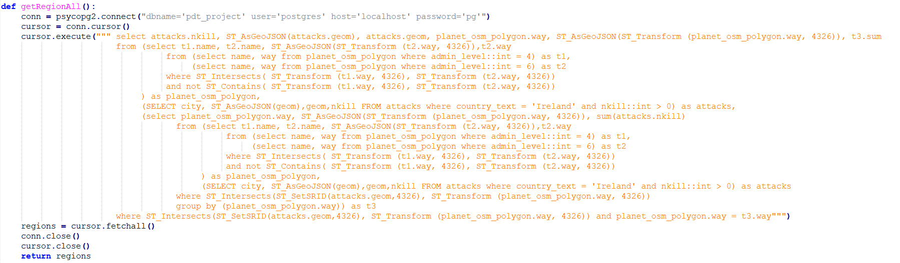
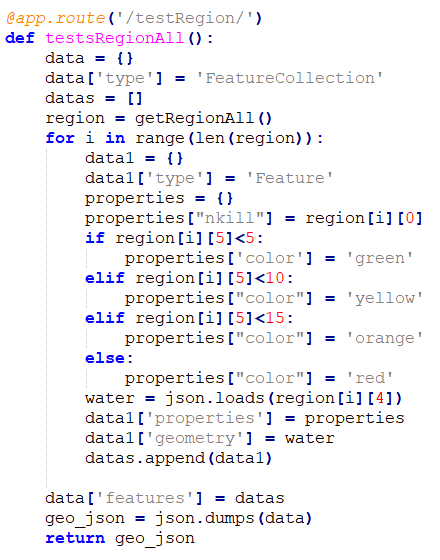

# Overview

This application shows terror attacks in Ireland and/or in United Kingdom. Most important features are:
- Heatmap of terror attacks form 1970
- Exact locations of every attack (markers)
- Can show the top n buildings of same type in defined distance
- Can show the all lakes, rivers, sees in defined dictance
- Shows the regions on the border of Ireland and Northern Ireland and color it by sum of deads in terror attacks

This is it in action:

The application has 2 separate parts, the client which is a [frontend web application](#frontend) using mapbox GL API and mapbox-gl.js and the [backend application](#backend) written in [Python](https://www.python.org/) using Flask server, backed by PostGIS. The frontend application communicates with backend using a [REST API](#api).

# Frontend

The frontend application is a static HTML page (`index.html`), which shows a mapbox-gl.js widget. It is displaying terror attack in Ireland. The map stzle is simle "light". 

All relevant frontend code is in `index.html`.
The frontend code is very simple, its only responsibilities are:
- displaying the whole map
- displaying the sidebar
- displaying the informations on map (heatmap, markers, polygons)
- handle users action (clicks)
- adding layers and sources into map

# Backend

The backend application was written in Python. This part of applicaion is responsible for comunicating with database and send data to frontend layer. For getting datas we used queryies and forcommunication we used flask.

## Data

Terror attack data is from Kaggle. I downloaded the full dataset and uplouaded it into database with my own py script. For this reason i used my own python script (load_terror.py).

Data about ireland were from Open Street Maps. I downloaded whole ireland (40 gb) and importet it using teh "osm2psql" tool.

## Queries

**Find terror attack in Ireland/United Kingdom**

*Description*
Get information about all attack from table attacks, where the country is Ireland/ Ireland and United Kingdom.

**Get nearest shops to selected location**

*Description*
Get information about nearest supermarkets to selected point on map. Compute distance between selected poitn and supermarkets, order it by distance in ascending order and return back first 10.

**Get the nearest waters**

*Description*
Get information about all waters/waterways in the distance of selected point. Compute distances between selected point and water/waterways and return the first 200 between the defined range.
          
**Get the regions near to the border, and compute the number of victioms**

*Description*
Get informations about the regions near to border between Ireland and United Kingdom. Firstly select the region with type 4 from database (Northen Ireland), get all regions which are next to it and from this table drop of northen ireland. From these regions select out these in which was terror attacks with number of victims bigger than one. 
After compute all number of victims and add it to every region.

*The explanation and analysis of queries is in explain_queries file*

### Response (GeoJson creation)

The responses from queries are differents but every contains a geoinformation (points or polygons).
These infromation is transformed into a valid geojson format. For this reason i was using json library in python:

