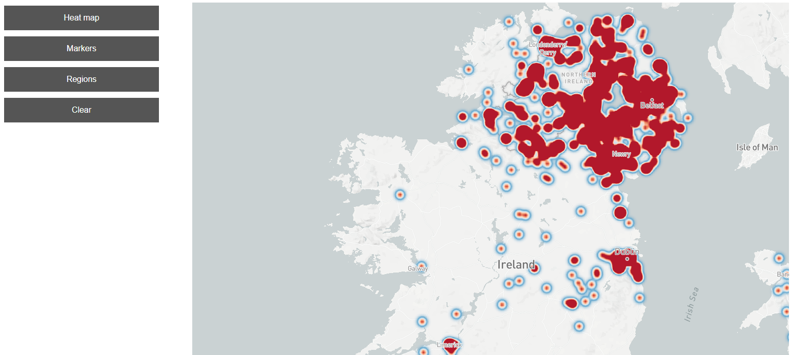
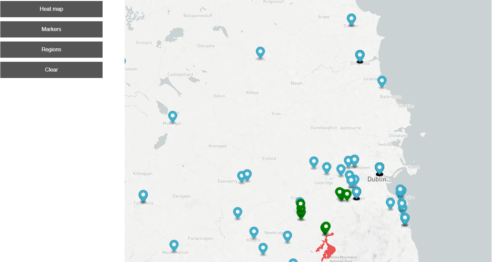
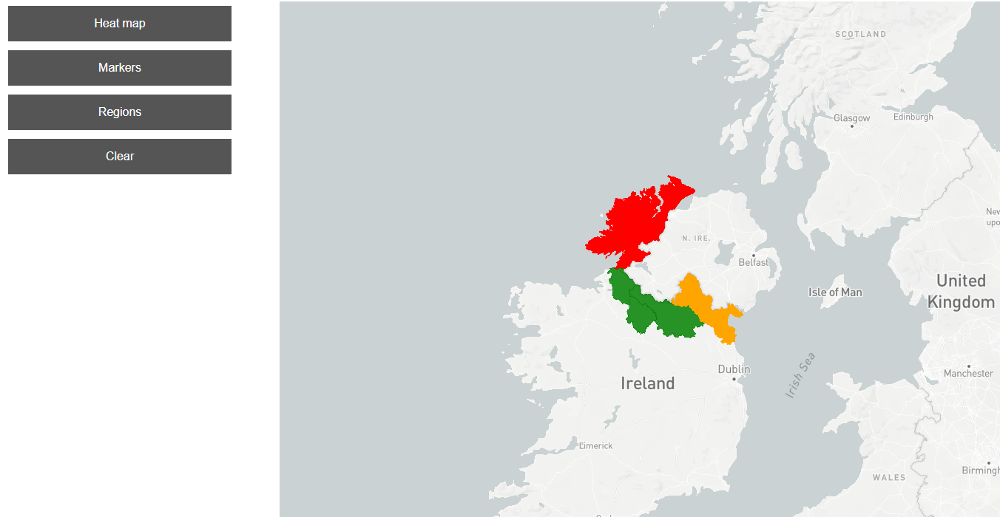
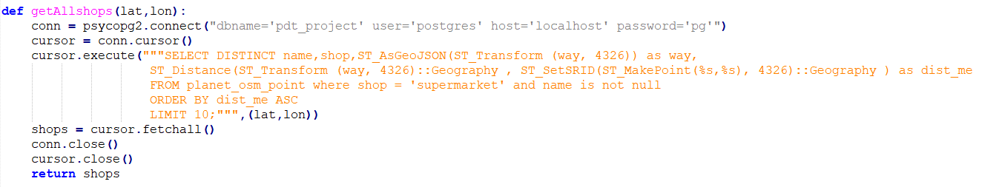
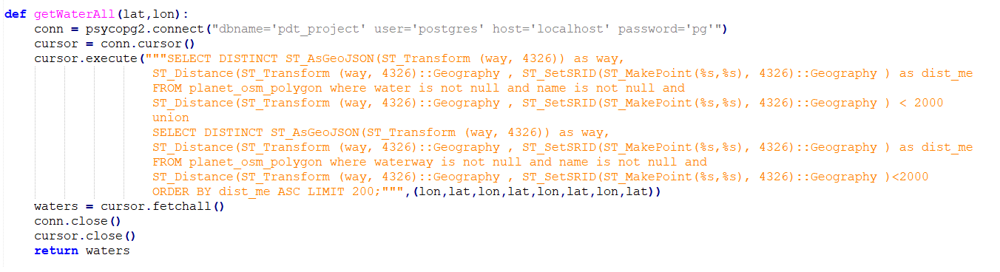
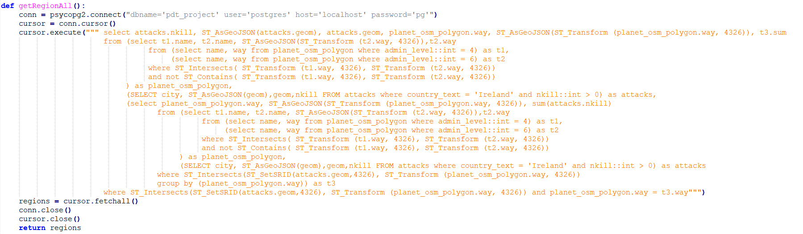

# Overview

This application shows terror attacks in Ireland and/or in United Kingdom. Most important features are:
- Heatmap of terror attacks form 1970
- Exact locations of every attack (markers)
- Can show the top n buildings of same type in defined distance
- Can show the all lakes, rivers, sees in defined dictance
- Shows the regions on the border of Ireland and Northern Ireland and color it by sum of deads in terror attacks

This is it in action:

The application has 2 separate parts, the client which is a [frontend web application](#frontend) using mapbox GL API and mapbox-gl.js and the [backend application](#backend) written in [Python](https://www.python.org/) using Flask server, backed by PostGIS. The frontend application communicates with backend using a [REST API](#api).

# Frontend

The frontend application is a static HTML page (`index.html`), which shows a mapbox-gl.js widget. It is displaying terror attack in Ireland. The map stzle is simle "light". 

All relevant frontend code is in `index.html`.
The frontend code is very simple, its only responsibilities are:
- displaying the whole map
- displaying the sidebar
- displaying the informations on map (heatmap, markers, polygons)
- handle users action (clicks)
- adding layers and sources into map

# Backend

The backend application was written in Python. This part of applicaion is responsible for comunicating with database and send data to frontend layer. For getting datas we used queryies and forcommunication we used flask.

## Data

Terror attack data is from Kaggle. I downloaded the full dataset and uplouaded it into database with my own py script. For this reason i used my own python script (load_terror.py).

Data about ireland were from Open Street Maps. I downloaded whole ireland (40 gb) and importet it using teh "osm2psql" tool.

## Queries

**Find terror attack in Ireland/United Kingdom**

**Get nearest shops to selected location**

          
**Get the nearest waters**

          
**Get the regions near to the border, and compute the number of victioms**

### Response

The responses for queries are differents but every contains a geoinformation (points or polygons)
These infromation is transformed into a valid geojson format. For this reason i was using json library in python:

"data = {}
    data['type'] = 'FeatureCollection'
    datas = []
    shops = getAllshops();
    for i in range(len(shops)):
        data1 = {}
        data1['type'] = 'Feature'        
        properties = {}
        properties['name'] = shops[i][0]
        properties['type'] = shops[i][1]
        shop = json.loads(shops[i][2])
        data1['properties'] = properties
        data1['geometry'] = shop
        datas.append(data1)
        
    data['features'] = datas
    geo_json = json.dumps(data)"
